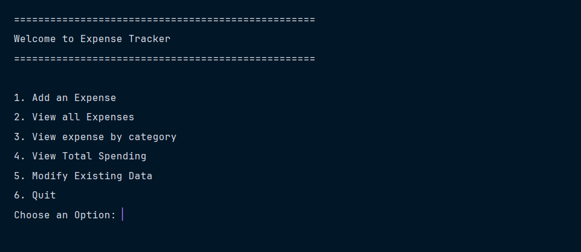
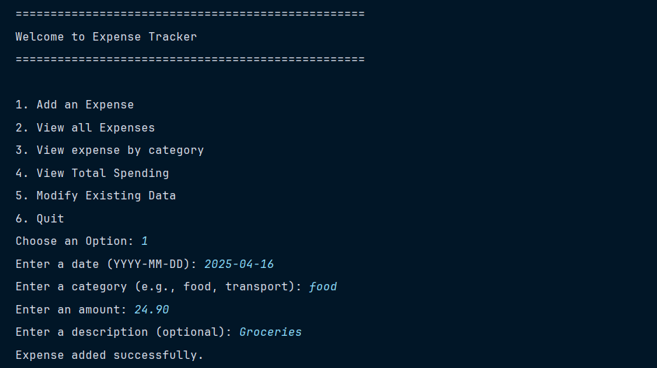
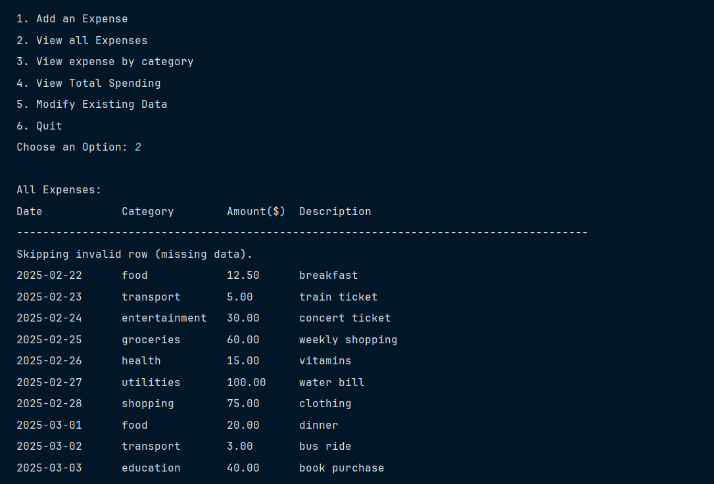
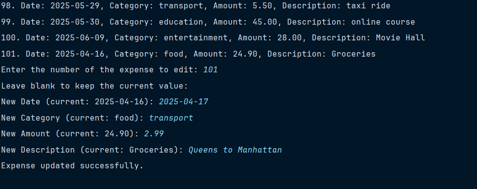
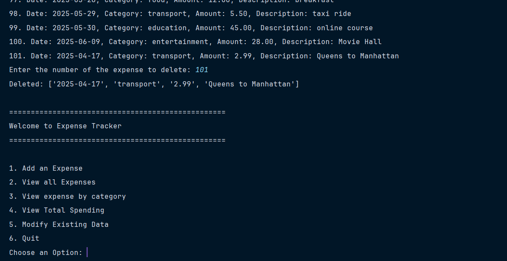
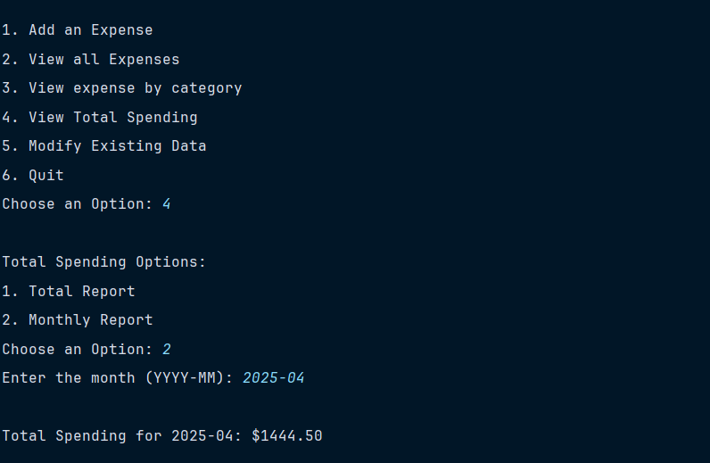

# 💰 Personal Expense Tracker (CLI-based)

A simple and interactive command-line application for tracking your personal expenses. This was my **first Python project**, where I practiced using **functions**, **CSV file handling**, and **exception error handling**.

---

## 📌 Features

- ✅ Add new expenses with description, category, and date
- ✅ View all recorded expenses in a clean tabular format
- ✅ Filter expenses by category
- ✅ View total spending or by month
- ✅ Edit or delete existing expense entries
- ✅ Input validation for better user experience
- ✅ Data stored in `expenses.csv` for easy access and backup

---

## 💽 Demo (Screenshots)

📸 **Main Menu**  


📸 **Add Expense**  


📸 **View All Expenses**  


📸 **Edit/Delete Expense**  



📸 **Monthly Report View**  


---

## 🧠 What I Learned

- How to **structure a Python project using functions**
- How to **read/write data using CSV**
- How to handle **file-related errors** using try-except blocks
- How to build a **menu-driven CLI application**
- Learned to **validate user input** and improve UX
- Basic debugging skills and iterative development

---

## 🔧 How to Run

1. Clone or download this repo  
2. Make sure you have Python installed  
3. Run the program:

```bash
python expense_tracker.py
```

Data will be stored in `expenses.csv` automatically.

---

## 💡 Future Improvements

- Add **graphical reports (pie/bar charts)** using libraries like `matplotlib`
- Optional **GUI version** with `tkinter` or `PyQt` (still exploring)
- Export reports to PDF or Excel
- Add login system for multi-user support

---

## 📂 File Structure

```
📁 expense-tracker/
🗋 expenses.csv          # stores all expense data
🗋 expense_tracker.py    # main Python program
🗋 README.md             # this file
```

---

## 🤝 Contributions

This was a solo project to improve my Python basics. Feedback or suggestions are welcome!

